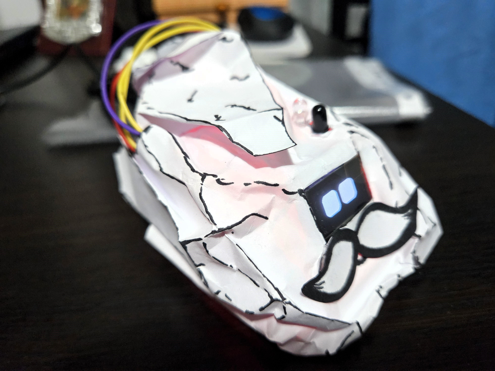
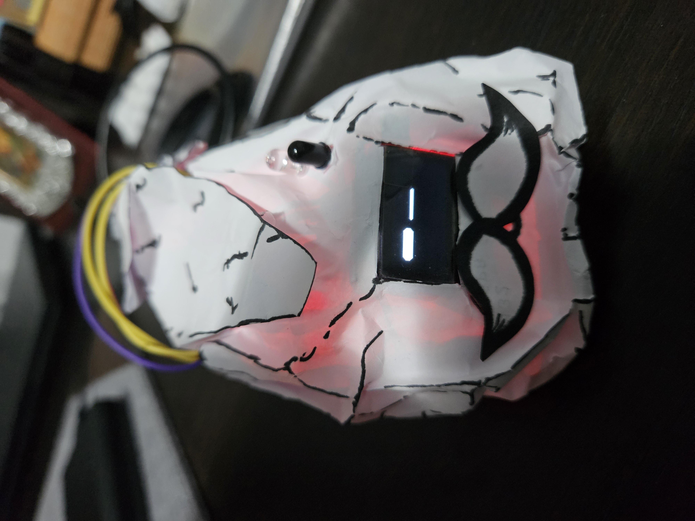
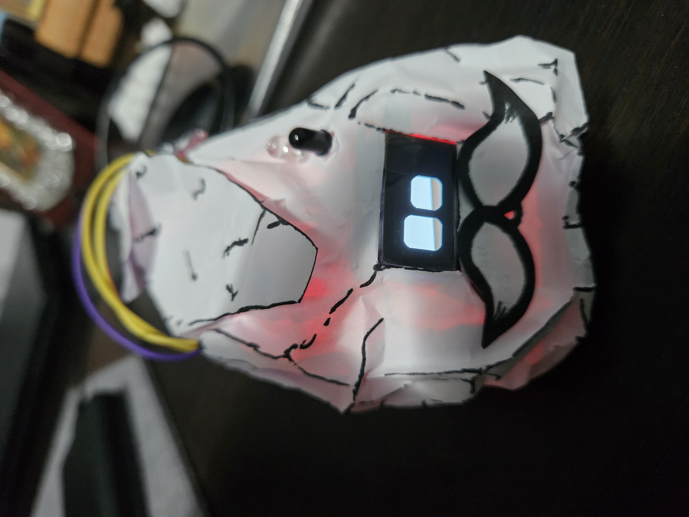
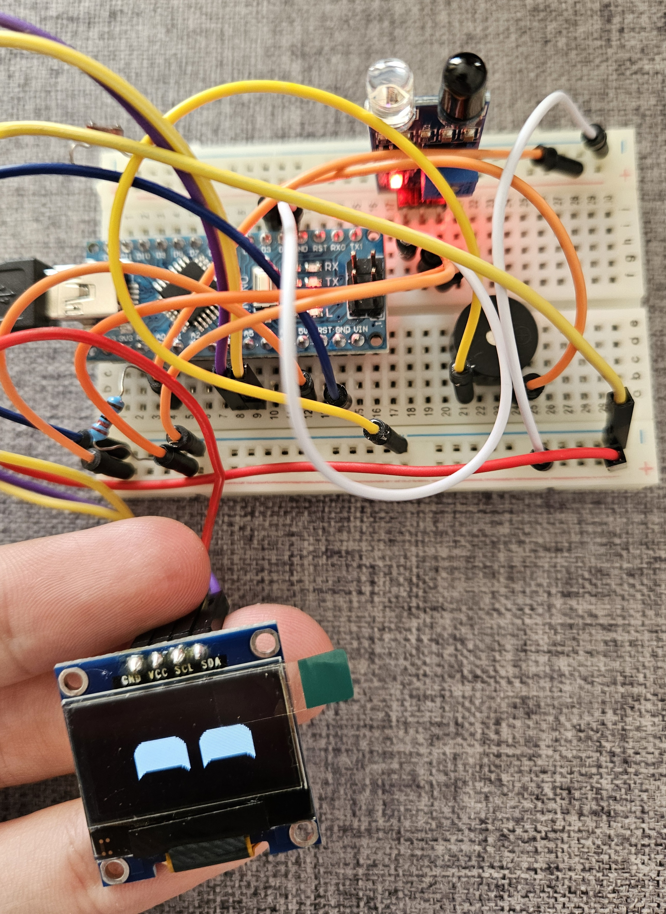
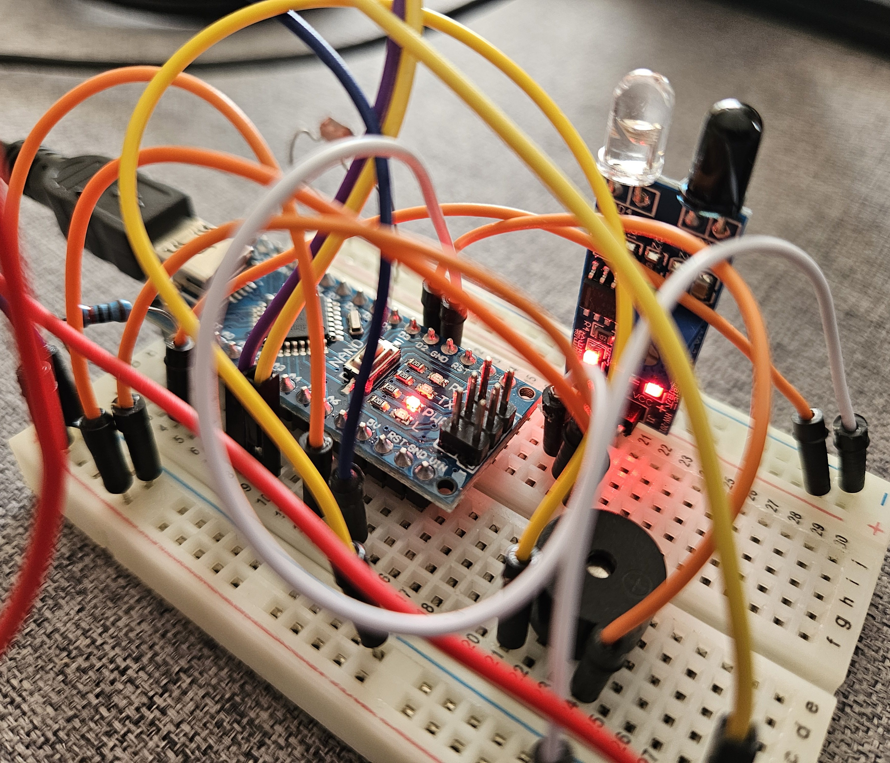

# DeskBuddy -  Digital Desk Companion 🤖

### 🎓 Academic Project
* **Developer:** Ștefan Bozomală
* **Institution:** Technical University of Cluj-Napoca (UTCN)  
* **Faculty:** Faculty of Automation and Computer Science  

---

## 📝 Project Overview

**DeskBuddy** is an interactive embedded system powered by the **Arduino Nano** platform, designed to act as an expressive desktop companion. Utilizing an OLED display and a suite of sensors, the robot dynamically changes its facial expressions and triggers audio feedback in response to environmental stimuli (light levels and motion/proximity).

The enclosure features a custom, artistic cell-shaded (sketch-style) textured paper design, giving the robot a distinct visual identity (complete with a "moustache" and polygonal contours).

This project demonstrates real-time task priority handling, state machine logic, and peripheral device control using the I2C communication protocol alongside digital/analog I/O.

---

## 📷 Prototype Showcase (Moods & Expressions)

| DEFAULT State (Idle) | ANGRY State (High Light Alert) | HAPPY State (IR Obstacle Trigger) |
| :---: | :---: | :---: |
|  |  |  |

---

## ✨ Key Features

*   **Real-Time Animated Eyes:** The robot blinks autonomously, looks around with curiosity, and shifts its emotional state based on sensor data.
*   **Proximity Reaction (IR Sensor):** When an object or hand approaches the robot, it switches to the **HAPPY** state and triggers a distinctive audio sequence (laughing effect) via the buzzer.
*   **Light Sensitivity (LDR Sensor):** If the ambient light exceeds a specific threshold, the robot transitions to the **ANGRY** state. This state has absolute priority over other sensor events.

---

## 📐 System Architecture (Block Diagram)

```text
   [ IR Proximity Sensor ] ---> ( Pin D2 ) ──┐
                                             ▼
   [ LDR Photoresistor ]   ---> ( Pin A0 ) ──┼---> [ ARDUINO NANO ] ---> ( I2C: A4/A5 ) ---> [ OLED Display ]
                                             ▲
                                             │
                                             └──> ( Pin D3 ) ---------> [ Passive Buzzer ]
```

### State Prioritization (Software Logic)
The system operates on a hierarchical decision-making structure:
1. **ANGRY State (Highest Priority):** Triggered by the photoresistor when ambient light surpasses the calibrated threshold. As long as this condition is active, inputs from the IR sensor are ignored to prevent state conflicts.
2. **HAPPY State (Medium Priority):** Triggered by the IR sensor when an obstacle is detected (`LOW` signal). It executes a single, non-blocking audio routine.
3. **DEFAULT State (Idle System):** Active when the environment is stable (normal light, no obstacles). The robot runs background routines like random blinking and curious eye movements.

---

## 🛠️ Hardware Configuration & Pinout

| Peripheral / Sensor | Arduino Pin | Signal Type | Description & Role |
| :--- | :--- | :--- | :--- |
| **IR Obstacle Sensor** | `Pin 2` | Digital INPUT | Detects object presence or proximity |
| **Buzzer** | `Pin 3` | Digital OUTPUT | Plays audio feedback using frequency pulses |
| **Photoresistor (LDR)**| `Pin A0` | Analogic INPUT | Measures light intensity on a scale from 0 to 1023 |
| **OLED Display SDA**   | `Pin A4` (SDA) | I2C Data | Serial Data line for transferring display frames |
| **OLED Display SCL**   | `Pin A5` (SCL) | I2C Clock | Serial Clock line for screen synchronization |

### Hardware Setup on Breadboard:
|  |  |
| :---: | :---: |

---

## 📚 Dependencies & Libraries

The project relies on the following libraries, which must be installed via the *Arduino Library Manager*:
*   `Adafruit_SSD1306` & `Adafruit_GFX` - For pixel-level control of the I2C OLED display.
*   `FluxGarage_RoboEyes` - A framework for matrix mapping of robotic facial expressions.

---

## 🚀 Installation, Setup, and Debugging

1. Connect your Arduino Nano to your PC using a USB cable.
2. Open the `companion.ino` file inside **Arduino IDE**.
3. Select the correct Board (**Arduino Nano**) and the appropriate COM Port from the `Tools` menu.
4. Click the **Upload** button.
5. **Debugging via Serial Monitor:** Open the Serial Monitor in the IDE and set the baud rate to **9600**. The system prints real-time sensor metrics and state transitions (e.g., `Prea multa lumina! Valoare: X` or `Obstacol detectat! Robotul rade.`).

---

## ⚙️ LDR Sensor Calibration

If the robot triggers the *ANGRY* state too easily or requires too much light due to your lab's ambient lighting, adjust the calibration constant at the top of the source code:
```cpp
const int PRAG_LUMINA_PUTERNICA = 200; // Increase this value for brighter environments
```
